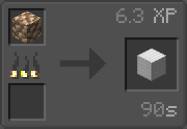
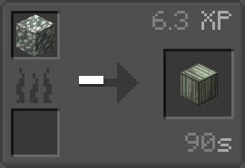

# Raw Ores Processing Datapack 粗矿处理数据包 原礦處理資料包

- [**Gallery 画廊 畫廊**](#gallery-画廊-畫廊)
- [**English README**](#english-readme)
- [**简体中文说明书**](#简体中文说明书)
- [**繁體中文說明書**](#繁體中文說明書)

---

## Gallery 画廊 畫廊

>Furnace  
>  

>Blast Furnace  
>  

>Mod Support  
>

---

## English README

This datapack adds a new furnace/blast furnace recipe for raw ore blocks  
Melts raw ore blocks into mineral blocks at a 9x slower rate

**Supported blocks:**
|             ID             |        Name       |
|----------------------------|-------------------|
|`minecraft:raw_iron_block`  |Block of Raw Iron  |
|`minecraft:raw_copper_block`|Block of Raw Copper|
|`minecraft:raw_gold_block`  |Block of Raw Gold  |
|`create:raw_zinc_block`     |Block of Raw Zinc  |

---

## 简体中文说明书

此数据包新增了粗矿块的熔炉/高炉配方  
可将粗矿块以9倍慢的方式烧成矿物块

**支援的方块有：**
|             ID             |中文名|
|----------------------------|---|
|`minecraft:raw_iron_block`  |粗铁块|
|`minecraft:raw_copper_block`|粗铜块|
|`minecraft:raw_gold_block`  |粗金块|
|`create:raw_zinc_block`     |粗锌块|

---

## 繁體中文說明書

此資料包新增了原礦塊的熔爐/高爐配方  
可將原礦塊以9倍慢的方式燒成礦物塊

**支援的方塊有：**
|             ID             |中文名|
|----------------------------|---|
|`minecraft:raw_iron_block`  |鐵原礦塊|
|`minecraft:raw_copper_block`|銅原礦塊|
|`minecraft:raw_gold_block`  |金原礦塊|
|`create:raw_zinc_block`     |鋅原礦塊|
