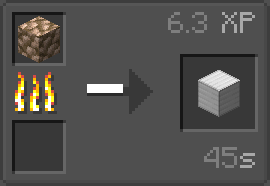

# 原矿处理资料包
  
| [English README](../README.md) | >简体中文说明书< | [繁體中文說明書](./README.zho-hant_TW.md) |

---

- [原矿处理资料包](#原矿处理资料包)
  - [画廊](#画廊)
  - [说明](#说明)
  - [其他连结](#其他连结)

---

## 画廊

>熔炉  
>  

>高炉  
>  

>模组支援  
>

---

## 说明

此资料包新增了原矿块的熔炉及高炉配方  
可将原矿块以9倍慢的方式烧成矿物块  
经验也会以9倍给予  

**支援的方块有：**
|              ID              | 中文名   |
|------------------------------|----------|
| `minecraft:raw_iron_block`   | 铁粗矿块 |
| `minecraft:raw_copper_block` | 铜粗矿块 |
| `minecraft:raw_gold_block`   | 金粗矿块 |
| `create:raw_zinc_block`      | 锌粗矿块 |

## 其他连结

Github: [https://mango-serives.github.io/src/link-list/RawOresProcessing-Datapack/github](https://mango-serives.github.io/src/link-list/RawOresProcessing-Datapack/github "Github")  
MC百科: [https://mango-serives.github.io/src/link-list/RawOresProcessing-Datapack/mcmod](https://mango-serives.github.io/src/link-list/RawOresProcessing-Datapack/mcmod "MC百科")  
CurseForge: [https://mango-serives.github.io/src/link-list/RawOresProcessing-Datapack/curseforge](https://mango-serives.github.io/src/link-list/RawOresProcessing-Datapack/curseforge "CurseForge")